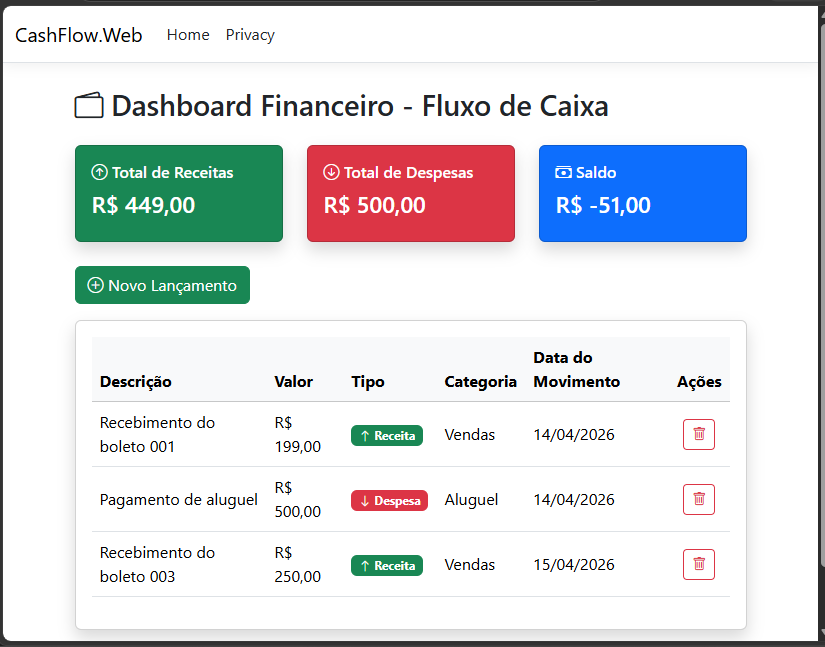

# Financial Control System

Simple financial control system built with ASP.NET MVC and Microsoft SQL Server for managing cash flow, income, and expenses.

---

## 🇧🇷 Descrição

Sistema simples de controle financeiro desenvolvido com ASP.NET MVC e Microsoft SQL Server.

Focado no gerenciamento de fluxo de caixa:
- receitas  
- despesas  
- saldo  

---

## 🚀 Features | Funcionalidades

### EN:
- Register income and expenses  
- Categorize financial transactions  
- Cash flow control  
- Basic CRUD operations  
- Simple and intuitive interface  

### PT-BR:
- Registrar receitas e despesas  
- Categorizar transações financeiras  
- Controle de fluxo de caixa  
- Operações básicas de CRUD (Criar, Ler e Excluir)  
- Interface simples e intuitiva  

---

## 🛠️ Technologies | Tecnologias

* ASP.NET MVC
* Entity Framework
* Microsoft SQL Server
* C#
* RAZOR

---

## 📚 Purpose | Objetivo

This project was developed for learning purposes, focusing on ASP.NET MVC and financial system design.

Este projeto foi desenvolvido para fins de aprendizado, com foco em ASP.NET MVC e modelagem de sistemas financeiros.

---

## 👨‍💻 Author | Autor

Developed by Janderson Arantes
